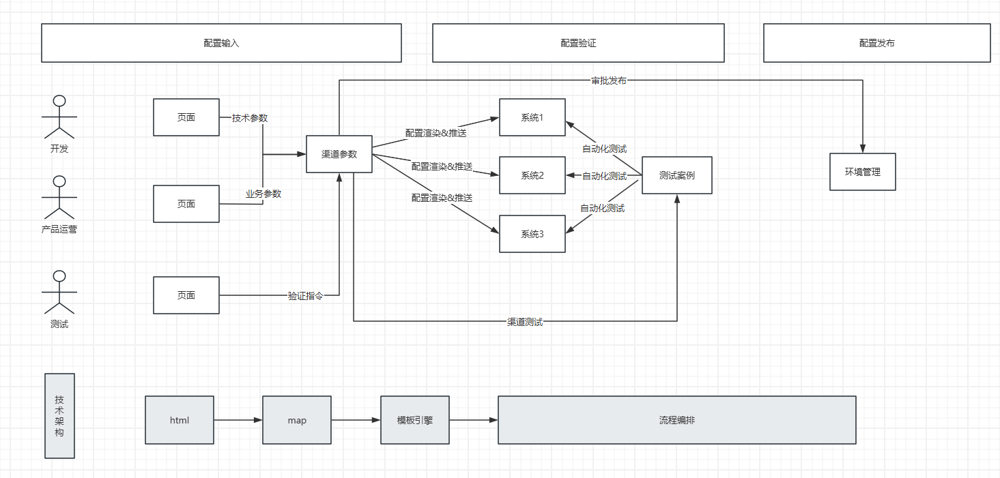

# DDD战略设计

DDD战略设计解决的问题是“如何从业务知识中提炼出领域模型”

要解决这个问题，必须首先解决如下两个问题

    业务模型长啥样？
    如何梳理？

第一个问题是方向性问题，不明确它，可能存在如下问题

    1，或者技术架构认为设计的内容是技术组件，是Pass、是组件、是中间件……等技术概念
    2，或者业务专家认为设计的内容需求1，需求2，需求3……中各种业务对象，活动……
    3，或者设计的产物是大杂烩；只是一个结果，但达不到领域模型的设计要求

## 业务模型定义

领域模型的目的是建立一个确定性的、抽象各种变化的、简单的模型。 **它最佳实践“三种熵为0，三种耦合为0”的三0架构**

何谓“三0架构”？ 在工程上，复杂度可以分类为以下几种

    1，业务复杂度
    2，技术复杂度
    3，工程复杂度 
    4，设计复杂度

    业务复杂度是客观的问题领域复杂度带来的。比如客户关系、市场格局、流程……等
    技术复杂度是客观问题落地为软件产品需要考虑的问题。如容量、规模、可用性
    工程复杂度是将软件产品实现必须考虑的问题。比如工程规模、开发流程模式、协作沟通方式、进度管理、质量控制……等
    以上三种复杂度是客观的，不随着不同的方案和设计而改变的。在《人月神话》中，被定义为必然复杂度。
    不良好的领域模型设计方案、技术方案、工程组织方式会导致额外的复杂度，这些额外的，导致不做工的复杂度称为熵。
        业务熵 = 领域模型复杂度 - 业务必然复杂度
        技术熵 = 技术设计复杂度 - 技术必然复杂度
        工程熵 = 工程实现复杂度 - 工程必然复杂度

最复杂的现实是，这几种复杂度是彼此耦合的。

    不合适的业务模型会导致更差的设计方案和技术方案，进而会影响组织架构；
    反过来，组织架构同样会影响正确模型的落地和实施。
    
甚至，很多情况下即使正确的领域设计、技术方案、组织架构；在其他要素不合理的情况下，也不能单独成功。
        

**领域模型，是期望建立这样一种模型**

    领域模型熵 = 业务熵接近于0 + 技术熵等于0 + 工程熵等于0 
    领域模型耦合 = 不耦合特定的业务 + 不耦合特定的技术 + 不耦合特定的组织架构

**一般而言，这样的设计，是成本最低、灵活度最高、风险最低、阻力最小、成功概率最高的架构。**

三0架构回答了领域模型不应该做什么的问题，但是没有回答它应该是什么样子的问题？
————如果给一个非常复杂的业务领域构建一个高可靠、高可扩展的模型的话。必须回答领域模型是什么样子的。并且它的模样要足够清晰，足够简单。

    理想中的领域模型是抽象出“领域结构————领域的拓扑架构”，领域拓扑架构包含3个要素
    
    1，拓扑顶点：领域角色抽象
    2，拓扑形状：流程抽象
    3，数据要素：数据抽象 

领域的拓扑结构回答了一个最简单的领域模型应该包含哪些要素。领域模型沉淀和梳理要围绕这些要素来。

## 梳理方法

    1，通过梳理业务流程来抽象基本的领域结构骨架。
    2，通过事件风暴来完善交易结构，形成领域模型
        2.1 头脑风暴交易角色的抽象和扩展（客户群扩展）
        2.2 头脑风暴交易流程的抽象和扩展（业务模式扩展）
        2.3 头脑风暴流程上的业务变化的扩展（业务词典）

## 战略设计容易踩坑的地方

    1，没有目标，先开枪再瞄准。不明白领域驱动是什么，不是什么，就开始干领域驱动。
    2，拿技术方案挂羊头卖狗肉当作领域模型来理解。

### 负面案例（采用了很多手段，得到一地鸡毛；但没有达到效果）

比如支付宝在10多年前，有一套基于safa框架的领域驱动规范，规定了领域驱动的工程结构规范是什么。

实际落地过程中存在的问题是99%的开发并不理解这套复杂的目录规范，日常开发其实就是找个目录把自己代码塞进去。如果代码结构不符合目录规范，就把代码拆的七零八碎。

然后被迫要做的事情是

     - 大量日常检查，检查代码是否符合规范（检查的人可能也大部分不明白，甚至理解冲突）
     - 大量日常教育，培训
效果寥寥.......最后这套做法不怎么强调了，不了了之。

### 正面案例（不拘泥于技术和手段，给出符合DDD效果的设计）

更常见的是很多人网上学了DDD的分层结构、洋葱模型、充血模型、聚合根……等一些“热门词汇”。 ——————这些只是手段，而不是领域（目的）。

**领域建模的目的永远围绕着问题领域，给出三0设计，而不在乎最终实现方式是什么手段。**

比如，2015年的时候ZFB的“金融交换系统“进行了了一次比较重大的系统升级，将原来70+个微服务聚合为6个应用。实现了系统的高度可维护、可扩展。————但，这个过程中最难的并不是系统改造，而是流量迁移。

原有70+微服务，3000+业务接口，上千个机构合作方、以及内部数十个个上下游协作部门&不计其数的系统、如何梳理遗留配置？如何改造？如何协调推进？联调？发布？上线……

最早的架构师提出了”ablity“+”component“的概念。 做了如下设计

    1，各个系统提炼、暴露出出自己系统中的各种能力组件。例如支付，对账、转账
    2，开放接入平台组合各个系统能力 ，构建出顶层用户可用的业务能力

这套系统上线后存在的问题
    
    1，能力的粒度模糊而不统一，有业务粒度的，比如支付转账，有技术粒度比如同步异步……他们之间的运算关系（组合）很难梳理和界定
    2，开放接入平台开发工作量很大，一个新模式测试和验证需要1个月；还不如手动迁移快
    3，大部分特定能力的组合通用性很差、只适用于特定几个业务；无法解决如此庞大复杂的业务

最终，我重新对微服务架构下、大量业务的系统迁移、验证、发布这个问题领域进行了抽象。其领域模型如下。

    
在这套架构下，实现一个业务模式只需要3个配置文件

    1，html：实现参数录入。  
           没有使用jsp，vue等技术，就是纯粹的html。任何人2分钟就能上手。
           业务动作就那么特定几个，保存，测试，审核确认等。固定成特定的url。
    2，Map：实现场景参数存储
        没有抽象任何bean和compent。
        也没有使用任何框架mybatis，hibernate……之类的。
        因为后续也没有任何领域逻辑，所有的操作只有保存，渲染，推送等
    3，模板文件：实现每个系统特定格式的配置渲染
    4，流程编排文件    
        不同场景，推送到不同节点，调用不用测试案例集

这套设计解决了微服务架构下的大量系统迁移、对接、验证的复杂度。用最经济、可靠的方式，确保了ZFB如此复杂场景下的大量系统迁移的可靠性。

# DDD战术设计

## 综述
DDD战略设计解决的问题是“如何将领域模型在概念上落地”

DDD战术设计解决的问题是“如何将领域模型在技术上落地”————即领域核心代码应该如何设计和落地的问题。
## 领域核心代码分类
在领域驱动最核心的对象中有以下几类最核心的对象

    事件对象
    实体对象
    值对象
    防腐层对象

这四种对象，是从概念角度，但在技术实现，它并不是一个对象（class），而可能是多个。例如

    事件对象：   聚合根 + payload
    实体对象：   实体Entity + 实体Service + 聚合
    值对象：     配置 + （Resolver） +  Engine
    防腐层：    Impl+Adapter
 
## 聚合根
 
[聚合根](聚合根.md)

## 实体/实体服务

一般上，业务系统实体和实体是分开的。这让他会导致一些争论。

我们从争论来理解实体、实体服务的最佳实践应该是什么。

[DDD对象角色模型和最佳实践.md](DDD%B6%D4%CF%F3%BD%C7%C9%AB%C4%A3%D0%CD%BA%CD%D7%EE%BC%D1%CA%B5%BC%F9.md)

 
## 

