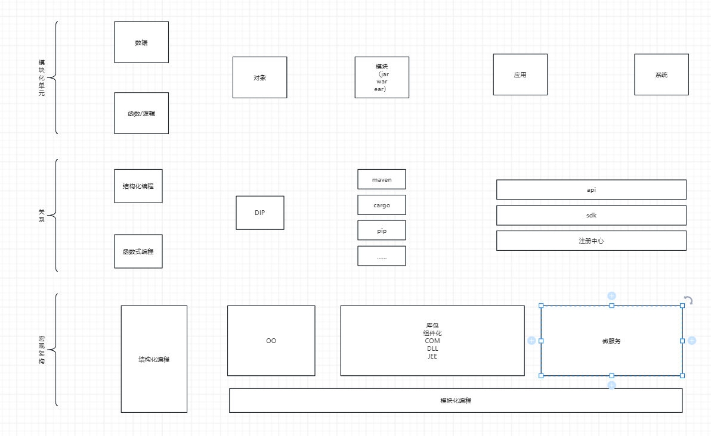

# 模块化发展的历史

起源阶段（20 世纪 60 年代）：
起源背景：模块化编程起源于软件工程实践。当时软件系统日益复杂，开发和维护难度不断增加，促使开发者寻找更好的组织和管理代码的方法。这一理念受到工业生产流水线分工合作的启发，如同汽车制造中零部件的生产分工，软件开发也希望将复杂的系统分解为独立、可组合的单元。
代表语言及特点：在这一时期，Fortran 和 Cobol 等编程语言开始出现子程序的概念，这可以看作是模块化的早期形式。子程序将一段具有特定功能的代码封装起来，方便在程序的不同部分重复调用，提高了代码的可维护性和可重用性。
发展阶段（20 世纪 70 年代 - 90 年代）：

面向对象编程的兴起：随着软件规模的进一步扩大，面向过程编程的局限性愈发明显，面向对象编程逐渐兴起。面向对象编程中的类和对象成为了模块化的重要载体，类不仅封装了数据，还包含了操作数据的方法，使得代码的组织更加清晰、可维护性更高。例如，C++、Java 等面向对象编程语言逐渐流行，它们通过类的封装、继承和多态等特性，更好地实现了模块化编程。
软件架构中的模块化探索：在这一时期，软件架构师开始探索如何在大型软件系统中更好地应用模块化技术。出现了分层架构、组件化架构等设计模式，将软件系统划分为不同的层次和组件，每个层次和组件都具有相对独立的功能，通过定义明确的接口进行交互。这种方式提高了软件的可扩展性和可维护性，使得大型软件系统的开发变得更加容易管理。
成熟阶段（21 世纪初 - 至今）：

编程语言对模块化的支持加强：现代编程语言如 Python、JavaScript 等对模块化的支持更加完善。例如，Python 中的模块和包机制，允许开发者将代码组织成独立的模块文件，并通过导入和使用这些模块来构建复杂的应用程序。JavaScript 在前端开发中也逐渐形成了多种模块化规范，如 AMD、CMD、CommonJS 等，解决了前端代码的模块化管理和依赖问题。
模块化在各领域的广泛应用：模块化技术不仅在软件开发中得到广泛应用，还在其他领域如电子设备、机械制造、建筑设计等得到了应用。例如，在电子设备领域，集成电路的设计采用了模块化的思想，将复杂的电路功能分解为多个模块，每个模块实现特定的功能，然后通过集成的方式构建出完整的电路系统；在机械制造领域，汽车、飞机等大型机械设备的生产也采用了模块化的设计和制造方法，提高了生产效率和产品质量。

总结

|     | 实体                  | 关系管理            | 
|-----|---------------------|-----------------| 
| 结构化 | 数据/逻辑               | 文件链接            | 
| 面向对象 | 对象                  | 访问控制符，包，封装      | 
| 组件  | dll，com，jar，war，ear | maven，cargo，pip | 
| 微服务 | sdk，api             | 注册中心            | 

# 结构化编程

    结构化编程的发展可以分为两个阶段
    1，编译器发展阶段，特点是从机器语言发展为高级编程语言。大大降低了编程的复杂度。
        在此阶段之后，程序的构成分为：人生成的部分，编译器生成的部分。（比如算术题1+2+3.。。。。。+100这个程序，会被编译器自动优化为N*N-1/2)
        编译器结构上分为词法分析、语法分析、语义分析、程序编译。优秀的编译器可以在这个阶段在一定程序上理解程序，并优化映射到最佳实践上。
    2，编译结构优化阶段：
        计算机专家们发现：大部分时候，开发人员生成的程序不如编译器生成的质量好，让编译器更多，更好的理解程序语义，对高级语言的结构和语法必须有一定
        的要求。
        其中，最重要的一个，就是程序结构和语义必须是单向有界的（DAG），这样编译器才可以比较有效的理解程序。
        这导致一个后果就是计算机专家们尽量去掉goto语句。
        
    结构化编程时代，对程序的一个巨大的影响是：面条式的代码结构
        
    这对一个蚂蚁一般不太复杂的事物还好，如果一个大象，被迫碾成这种扁平结构。在可维护性上、可理解性上无疑存在巨大的问题。

# 面向对象思想和面向对象编程

    在上世纪80年代，个人计算机大发展时代，软件也在迅速发展。过去那种黑乎乎的dos对于高学历人群适合，但是对于普通大众未必适合。
    GUI编程，图形化界面的Office，界面更绚丽的游戏……程序复杂度急剧膨胀，从几k到几个G。从自行车复杂为飞机。

    结构化编程已经不合适了。这时候，面向对象流行起来。
        
    面向对象思想核心内容如下 
    1，用不可变的积木组成复杂的软件，因其不可变，所以可靠，组装任意复杂都软件没有任何隐患。
    2，当面对业务变化时候，所有变化被分解为各个对象内在的变化。对整体没有任何影响。

    当然，这其中最关键的问题是在设计层面：考虑变化和对象抽象之间的关系，而不是语法————使用结构化语言一样可以做出OO的设计，使用OO的语言，未必给出的设计是OO的。

    这就是OOP（面向对象编程）和OOD（面向对象设计）

    但OOP也有极大的意义。
    通过类封装、包封装、访问控制符等限制了各种数据和逻辑的边界。使其变化对外部不可见。极大的降低了各种不可预测性。
    使用OOP，不一定可以做出OO的设计。
    但是，可以降低各种不可预测的风险的范围和影响。大规模团队协作时，这尤其有用。

# 组件化架构/库包、分层架构

    
    在windows时代，力推的组件是com，dll。
    在JEE时代，力推的组件是jar，war，ear（J2se，J2ee）
    
    这一套同样可以极大降低开发人员代码数量在整体软件中的比例，极大提升软件的质量————但不同于编译器，它具备更大的灵活性。更早期的C++只提供了语言，没有像后来的Java/C#们
    提供了丰富的库包。这一度让C++的创始人认为是最遗憾的事情。

    库包架构被学院派Sun发展到了极致
    针对不同的领域，他提供了几套不同的解决方案：
    移动市场：J2me
    企业市场：j2ee
    基础组件：j2se
    每一套，都提供了功能非常丰富的套件组件。

    在一套玩法，在后来被更细分为
    Saas
    pass
    Apass
    Iaas
    这一套和之前的区别在哪里呢？
    1，jar，ear，war等被统一为了jar
    2，各种端，技术上逐步趋向于同一种技术实现（vue，ng，hibird）
    3，更加聚焦于业务领域，聚焦于实际的问题
        saas：业务问题
        paas/apaas：通用的技术，和业务能力
        Iass：基础设施可用性，弹性……
    架构分层，实际上更简练，更聚焦，更有价值。

# 微服务

    将一个模块，实现为一个微服务应用，有什么好处呢？
    好处不多。坏处不少
    比如部署成本、运维成本、性能、可靠性……都在急剧下降

    但最大的好处在于架构体系的开放性：通过http，python，java，c#等可以自由交互。
    另外最大的好处在于可管理性————其将业务概念之间的关系映射为开发团队之间的关系。通过团队之间的PK实现设计的合理性。
    在性能不敏感的、业务需求变化比较频繁、复杂的应用开发场景，具有比较大的优势。
        
    在一个技术架构统一的公司，显然，微服务架构不如模块化架构更有性价比。
    在一个运行时规模庞大的公司，显然，微服务架构不如模块化架构更有性价比。
    在一个对延迟要求极高的场景，显然，微服务架构不如模块化架构更有性价比。
    在一个对一致性要求极高的场景，显然，微服务架构不如模块化架构更有性价比。

    比如，对延迟极其敏感的游戏领域，不适合微服务，而适合ECS
    在分布式计算领域，就适合函数式架构（scala)
    在一致性要求比较高的复杂业务场景，更适合微服务+流程编排。

# 新的发展
    
    1，值对象/数据对象
    2，协程/虚拟线程
    3，AOT

