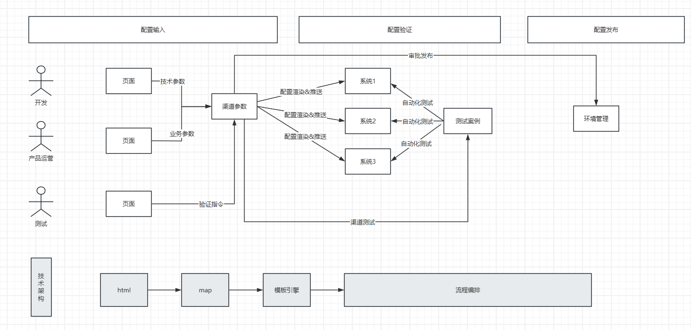

# 负面案例（采用了很多手段，得到一地鸡毛；但没有达到效果）

比如ZFB在10多年前，有一套基于safa框架的领域驱动规范，规定了领域驱动的工程结构规范是什么。

实际落地过程中存在的问题是99%的开发并不理解这套复杂的目录规范，日常开发其实就是找个目录把自己代码塞进去。如果代码结构不符合目录规范，就把代码拆的七零八碎。

然后被迫要做的事情是

     - 大量日常检查，检查代码是否符合规范（检查的人可能也大部分不明白，甚至理解冲突）
     - 大量日常教育，培训

效果寥寥.......最后这套做法不再推荐了，不了了之。

# 正面案例（不拘泥于技术和手段，给出符合DDD效果的设计）

比如，2015年的时候ZFB的“金融交换系统“进行了了一次比较重大的系统升级，将原来70+个微服务聚合为6个应用。实现了系统的高度可维护、可扩展。————但，这个过程中最难的并不是系统改造，而是流量迁移。

原有70+微服务，3000+业务接口，上千个机构合作方、以及内部数十个个上下游协作部门&不计其数的系统、如何梳理遗留配置？如何改造？如何协调推进？联调？发布？上线……

最早的架构师提出了”ablity“+”component“的概念。 做了如下设计

    1，各个系统提炼、暴露出出自己系统中的各种能力组件。例如支付，对账、转账
    2，开放接入平台组合各个系统能力 ，构建出顶层用户可用的业务能力

这套系统上线后存在的问题

    1，能力的粒度模糊而不统一，有业务粒度的，比如支付转账，有技术粒度比如同步异步……他们之间的运算关系（组合）很难梳理和界定
    2，开放接入平台开发工作量很大，一个新模式测试和验证需要1个月；还不如手动迁移快
    3，大部分特定能力的组合通用性很差、只适用于特定几个业务；无法解决如此庞大复杂的业务

最终，我重新对微服务架构下、大量业务的系统迁移、验证、发布这个问题领域进行了抽象。其领域模型如下。

在这套架构下，实现一个业务模式只需要3个配置文件

    1，html：实现参数录入。  
           没有使用jsp，vue等技术，就是纯粹的html。任何人2分钟就能上手。
           业务动作就那么特定几个，保存，测试，审核确认等。固定成特定的url。
    2，Map：实现场景参数存储
        没有抽象任何bean和compent。
        也没有使用任何框架mybatis，hibernate……之类的。
        因为后续也没有任何领域逻辑，所有的操作只有保存，渲染，推送等
    3，模板文件：实现每个系统特定格式的配置渲染
    4，流程编排文件    
        不同场景，推送到不同节点，调用不用测试案例集

这套设计解决了微服务架构下的大量系统迁移、对接、验证的复杂度。用最经济、可靠的方式，确保了ZFB如此复杂场景下的大量系统迁移的可靠性。

**领域建模的目的围绕着问题领域，给出三0设计，而不在乎最终实现方式是什么手段。**