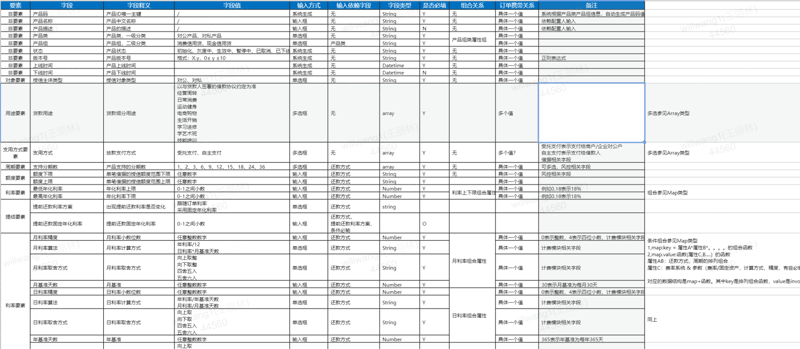
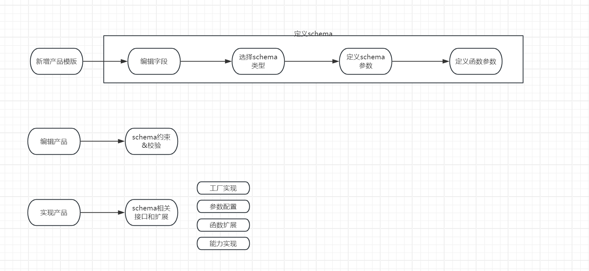

# 产品工厂

# 1，产品工厂概念是什么？

产品工厂的概念在90年代银行圈非常火，当时还有流程银行等概念，如同现在的“智慧城市”一样————IBM总是能直击客户的痛点。 
不过也仅限于此，在落地方案上，往往是不了了之。

# 2，厂商的做法

不过，这方向总是对的，这10多年，我还是比较关注这方面的进展————国内很多厂商其实都有配套提供所谓的产品工厂系统。
在我看来，他们只不过把原有的参数管理系统起个名字。而并没有真正达到产品工厂想要达到的境界————改改参数，就能拼出一个
新产品出来。

[图片1.jpg]
[图片2.jpg]

# 3，我们的设计和野望

## 思考1：重点应该是什么？

产品工厂的重点，不是配置化，不是界面友好的托拉拽……
所有的厂商都具备这个能力，但是效果上来看，并没有达到产品工厂的设计目标。
当前不能支持产品工厂理念的瓶颈并不在配置端，而在实现端。————是应用层实现层的质量不行，导致产品可配不可run，能run不管对……
当前大部分系统在实现上是和特定参数绑死了。而所谓的产品工厂，是这个结果的绣花枕头。枕头绣的再漂亮，不解决实质的问题。

逻辑上，如果要达到产品工厂的境界的话，业务系统其实是是个产品领域语言解析器。去解析和运行领域特定的DSL。

产品经理在产品工厂上的核心职责，就是定义出这些关键概念，以及他们之间的关系。

例如一个信贷产品的领域DSL定义如下。

1，定义客户的特征

2，定义产品的特征（6要素+N，客群特征，额度，利率，周期，还款方式，费率，……）

3，定义交易结构（客户/渠道，平台方，担保方……）和利益分配机制、关联匹配机制

而无需关注
1，技术实现方式

2，流程等

其关注的是业务相关方、利益机制、由此导向的设计和参数。而不关注如何做到。

## 思考2：组件的治理——产品层概念和实现层概念。
在我们观察到的系统，和借鉴到的理论中，这个理想的领域DSL是不存在的，能看到的产品工厂是各种要要素的混合

————比如建行的实践（参见《银行产品工厂》）中是将流程，组织架构等也包含在产品之内的。
而最好的厂商设计，是各组件配置的聚合（存在一致性问题）
 
这对开发而言，是很直观的————开发无需考虑这个参数属于产品工厂，我从产品工厂哪里拿，那个参数属于技术实现，我从apollo取。

但，按照MECE的原则，技术实现和产品设计是正交的。而不是强相关的。这种正交是一个很简单的mapping关系（界限上下文映射）

但是通过这种分离，可以带来极大的产品灵活性、技术架构灵活性。技术的归技术，产品的归产品。

——————我们已经定义了产品概念层应该思考的关键特征。那么技术层考虑的是什么呢？

1，将以上交易结构的各种变化形成特定的状态流程（几何拓扑结构）
2，通用化技术架构：确保这种几何拓扑结构的通用性，灵活性。既能支持此类产品，又能支持另一类产品。只要他们的拓扑结构是一致的。
3，设计产品DSL解析引擎，将流程和特定产品DSL方言解耦分离。实现流程的可扩展性和业务解耦，业务之间解耦。
4，驱动流程中各个步骤组件，实现各个步骤相似功能的组件化，配置化，扩展化。例如邮件，审批，短信，计费，合同……
5，选取合适的技术组件，在合适的技术复杂度下，支持对应的性能，一致性，复杂性，可靠性

## 思考3：治理的思路？

## 思考4：治理的手段？

附录：

https://baike.baidu.com/item/%E9%93%B6%E8%A1%8C%E4%BA%A7%E5%93%81%E5%B7%A5%E5%8E%82/2051639?fr=ge_ala

