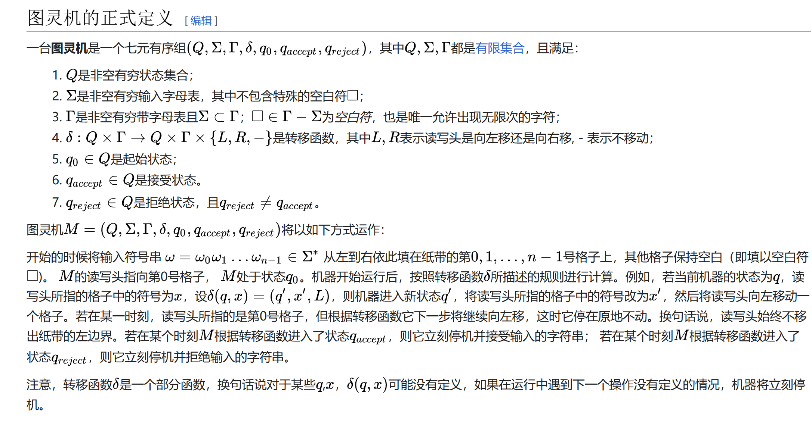

### 程序 = 输出/输入 + 状态+ 符号表
https://zh.wikipedia.org/wiki/%E5%9B%BE%E7%81%B5%E6%9C%BA

从形式上看，图灵机 = 输出入+有限状态机+知识库

    1，人工智能是否永远不能超越只是既有知识的组合？
    2，有限和无限
    2，输入信息有两大类：充分信息和不充分信息。
           从输出角度讲，程序是确定性的，收敛的。
           充分信息的输入是足够的，程序是输入和输出之间的一个明确清晰的映射关系。
           不充分信息的输入是欠缺的。程序是呈现高度的摘要收敛能力。例如从只有猫的一个耳朵的相片，判断出猫。
 

### 程序 = 数据 + 逻辑
结构化编程时期的经典抽象。

### 程序 = 对象 + 消息
对象编程时期的经典抽象。

其中对象= 数据 + 逻辑————这并不仅仅是排列组合或者文字游戏。注意：消息这个概念在上一个抽象（数据+逻辑）中并不存在————
上者是对程序实现本身的结构的抽象。而面向对象是对所要解决的问题领域的抽象。

    消息 = 关系 = 问题领域概念的关系
    对象 = 问题领域概念（的属性和行为）

因此，在问题表现能力，面向对象相比之前要强的多。最关键的，是其思考和设计方式不一样了。
在结构化编程之中，开发过程是

    1，设计流程图
    2，根据流程图实现功能

在面向对象开发过程中，是这样的

    1，设计流程图
    2，设计对象
    3，使用事件消息串联对象

这并非仅仅对之前概念做个名词替换。因为在面向对象的核心设计思想中，有一个很少有人强调提却非常重要的概念：不可变性
————对象本身是不变的，它可以把所有它的变化表现为它的属性和方法，而变化本身对外部透明不可见。

理解一下发明了面向对象概念的老爷子运用这套思想设计的的MVC。他嘴巴里的对象根本不是开发理解的那个class或者object，
他嘴巴里的对象更接近于我们理解的领域模型。 

基于对象的这种不可变设计，由此可以积木式的构造复杂的软件大厦。

    本质上，面向对象开发，模块化开发。。。。。都是同一种东西。区别在于，他们的表现形态不同。同样一种架构设计，在对
    延迟更好的游戏领域、就必须做模块化，表现为sdk；在对延迟更不敏感的应用系统中，就表现为微服务架构。

    在架构图中，无论是层次图、类图、模块图、还是应用架构图。。。。。是同质的。不同的人设计的形式上有差别，语义上
    是同一个。
    一般而言，我们在架构设计上追求最低的复杂度，所以仅提及面向对象设计即可。在实施上，追求最小知识原则，所以受众
    理解什么我们说什么。

### 程序 = 实体 + 值对象   

在DDD理论中，程序 = 实体 + 值对象。————具体概念介绍参见[领域驱动：代码模型](领域驱动：代码角色模型.MD)

实体是无限的抽象，他抽象了着世界和软件的交互和映射。
值对象是软件本身的抽象。
建立在这两个最基本抽象之上，构建了复杂软件应该如何设计的最佳实践。

熟悉生命演化理论的想必知道真核细胞的产生对于复杂生命的意义，领域驱动代码角色模型对于复杂软件相当于真核细胞

| 原核细胞      | 真核细胞      | 领域驱动：代码角色模型 |  
|-----------|-----------|---------|
| DNA核，结构简单 | DNA核，结构复杂 | 事件对象    |  
| 能量/物质     | 能量/物质     | 实体      |  
| 质膜        | 叶绿体 /线粒体  | 值对象     |  
| 无         | 内质网       | 聚合      |  
|          |           | 上下文     |  
| 无膜        | 双膜        | 隔离层     |  
| 海绵等简单生命   | 复杂生物      | 扩展代码    |  

**事实上，决定大多数软件架构成败的，并不是概念一致性：大部分遗留项目并不存在这个问题——是开发基本功的匮乏**
我认为领域驱动最有价值的，就是他提出了一套比较客观的，写复杂代码的最佳实践。

当然，生命进化35亿年，然而有15亿年左右都是简单细胞的进化。却始终无法产生超越海绵复杂度的生命。直到真核细胞诞生，虽然历经5次生命大灭绝，却能在几亿年
能诞生复杂于海绵N倍的鱼、恐龙、甚至人类。

### 软件 = 容器 + 组件 +胶水

### 软件工程复杂度 = 本质复杂度 + 偶然复杂度
本质复杂度/偶然是brooks在70年前提到的概念。
前者代表一个问题领域的最低复杂度
后者代表我们在工程实现中增加的各种复杂度

如同热力学守恒一样，在架构设计中同样存在“复杂度守恒”

    本质复杂度守恒 
    偶然复杂度增加并永远不为0

所以，KISS之所以不对，是因为有些事物就是复杂的、掩饰其复杂度的设计只能让其变得更复杂。所以，虽然相对论相比牛顿三定律要复杂很多倍。
可他依然比牛顿三定律更美；因为其背后包含的问题域的复杂度要远远超过前者。简单和复杂只是相对于问题域而言————其每个符号所包含的信息密度
要远超其他解决方案————抛开问题域的简单毫无意义。

在整个软件工程的各个环节都充斥了各种熵

    1，设计熵：设计不够通用、或者过度设计、设计的过于复杂
    2，开发流程熵：不该用的用了。。。。。该用敏捷的用了瀑布、该用瀑布的用了敏捷……
    3，组织架构熵：
    4，技术熵：

###  信息 = 架构

一个输入/输出有清晰明确映射去关系且的架构在数学上是收敛的。

    这种收敛结构就是他的架构； 
    在系统论上，即自组织系统
    在热力学上，即熵减系统； 
    薛定谔说：熵减即生命。

这种收敛结构在视觉上呈现一颗以流程为核心的树状和网状架构
这种收敛结构在数据上呈现就是聚合根。聚合根决定了这种收敛系统的架构。
聚合根是一个系统感知的外界输入的信息。

    树状结构：普通程序（完全信息架构）
    网状结构：人工智能、大脑（不完全信息架构）
    盖亚

