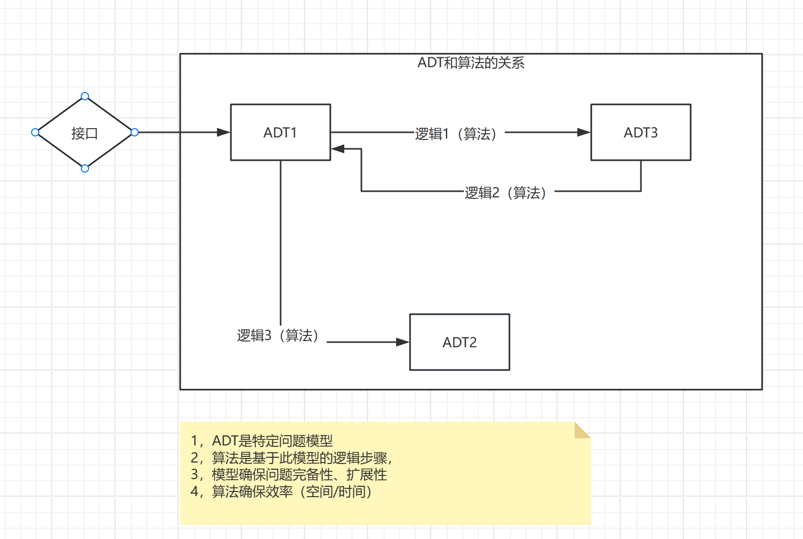

# 概述

# UNIX：一切皆文件
    https://www.zhihu.com/question/25696682

# 管道的艺术 
    
    unix的强大，70%要归功于管道的灵活
    
    https://zh.wikipedia.org/wiki/%E7%AE%A1%E9%81%93_(Unix)
    
    1，管道也是文件
    
    2，管道是倒置的文件
    
    3，管道是一种文件的组合关系

# EXCEL  =CELL 

    office5剑客中，最强的是excel。
    可以写表格
    
    可以当数据库
    
    可以当word
    
    可以组网页
    
    可以做游戏
    
    可以……
    
    但，其实，excel是office中开发最快，代码量最小的。
    
    根本的原因是
    
    他的架构是最优雅的，所有的东西都源于cell这个最基本的抽象。
https://www.bilibili.com/read/cv18076300/

# c语言：数据结构的秘密

    所有的编程高手都在说：编程中最重要的是数据结构。
    
    …………
    
    等等，一脸迷惑
    
    是HashMap ，List ，Tree等等么？
    
    或者是离散数学的二叉树、图？
    
    或者是c语言的stuct？
    
    这这些东西似乎也没什么用啊 ……
    
    卖个小关子
    
    c语言：数据结构
    java:值对象
    ddd：值对象
    
    ……你懂了么？
    
    
    没懂？
    
    我再来一行
    
    **架构：变化**

# 算法：ADT————见诸相非相，既见如来

    很多程序员刷了“一辈子”算法，但其实并不懂算法一点不重要
    
    —— 最重要的不是算法，而是算法后面的数据结构。
    
    从问题域 = 问题域的领域模型 = 问题域的数据结构（ADT）。
    
    是计算机科学中最重要的的思想。
    
    
    而算法，只是体现ADT中各种DT之间的关系和逻辑。
    
    
    
    ADT确保：模型完备性，可扩展性
    
    算法确保：效率，性能

# 面向抽象开发：从POSIX，到COM，到JEE

IBM在著名的"焦油坑”项目OS360中，总结的一个最重要的经验是：通过合适的模块划分，分工协作，可以大大的降低系统的风险。

在这个伟大的工程之后，所有成功的架构体系都基本遵循了

API + 组件实现    的结构

POSIX，COM，JEE，概莫能外 

    接口的良好设计参见《[如何设计良好的接口.md](%C8%E7%BA%CE%C9%E8%BC%C6%C1%BC%BA%C3%B5%C4%BD%D3%BF%DA.md)如何设计良好的接口 》
    这个心法可以辅助你设计出信息完备和能力完备的接口。

    面向抽象开发，基于聚合根原理。实现了
    1，接口可以涵盖完备信息和完备能力
    2，屏蔽实现复杂度，只需要关注数据和能力复杂度
    3，将数据和能力复杂度降低到最低（数据：id；能力：code）
    
    它看起来非常强大，似乎能够克服一切困难。但他真的能克服软件的所有困难吗？
    
    我们回忆一下《人月神话》中定义的软件的根本困难
    
        概念，和概念之间的关系，以及变化。。。。。
    
    这是一切复杂性和混沌的根源。面向抽象可以很好的屏蔽概念，关系，也可以屏蔽很多变化，但是能屏蔽所有的变化么？

    似乎没有证据证明可以————实际上也不可以。

    如何解决呢？
 

# 容器：集大成者

在API-组件的关系中

API负责对外提供不变性，接受信息

组件负责实现/屏蔽各种内部变化

逻辑上来讲，组件可以容纳任何变化。但受限于接口，他不行。

这意味着组件只能容纳部分的、特定的变化————这也正是JEE组件体系中对各种组件的定位。

如果一个问题域中变化是无穷无尽的，如之奈何？ 

    J2EE体系天才性的提出了一种空的组件，正因为空，所有无所不包，无所不能。这个“无能”的组件，被认为是JEE体系中最重要的组成部分。
    它有一个广为人知的，大名鼎鼎的名字：容器。
 
    在容器上各种无所不能的扩展，被称为let 
    客户端容器:applet
    web容器:servlet
    ejb容器:servless
 
    这种思想影响西方计算工业圈很深远

    芯片设计：chiplet

    在这个架构体系中，
        容器管面：逻辑上涵盖了负责所有变化的可能性的空间
        let：管线，按需定制，随变而生
        组件：管点，配合let，减少let的开发工作量

    完美。

    
JEE架构体系横空出世之后，被称为企业级架构之集大成者。 其思想高度，至今难以超越。就逻辑而言，已堪完美。

    JEE很完美，很完美，很完美
    然而，确有一个阿喀琉斯之踝————实现。
    各种厂商的实现都不那么“尽如人意”，无论是哪个厂商的实现，都有很强的耦合性。使的虽然名义上是针对api开发，可移植，实际上移殖不了。

    原因不在技术，在商业。只要在商言商，就必然存在这种情况。

    在这种情况下,开源社区提供了另外一种JEE的实现————spring————完美的解决了这一问题。

spring之后，软件开发就看起来一帆风顺了么？

幼稚。 你看现在遍地软件公司内部有几个系统是清晰整洁的？

那只是概念上和技术上，解决了各种业务扩展的可能性和耦合行。

实际上，在各种let中，依然在业务逻辑概念上和实际实现层存在千丝万缕的耦合，和不可扩展隐患。

 
# 流程编排

    spring的出现，最大的意义并不提升了开发效率和体验。（这一点它远远比不上同时代的python，ruby们）
    
    而是它大大降低了开发严肃的企业级应用的门槛，给了众多“屌丝企业”一个入场的机会。
    在此之前，他们不但出不起企业级服务器的硬件的钱，连买服务器的钱也出不起。
    硬着头皮硬上，“企业级软件”的一致性、可靠性、高可用要求会教育他们倾家荡产。
    
    在spring之后，各种软件公司遍地开发
        
    然而，正如历史上4次软件危机曾经经历过的一样，每个“银弹”之后，是更大的业务场景扩展，紧接着更大的危机
    结构化编程vs从军工=>院校/政府
    面向对象 vs从院校到PC
    J2EE vs 从PC到社会各个领域/行业 
    SOA&微服务 vs 互联网&移动

容器虽完美，优雅，内部也架不住这么复杂。
 
于是，有人提出了另外一种编程抽象

    程序  = 数据 + 流程 + 逻辑

这种抽象也并非凭空出现，在软件的历史上，工作流等等软件也十分盛行。

不过，他们有细微的差别

    1，和流程编排等价的技术其实很早就有了，但并不是一个独立的组件，也没有针对性的解决特定的问题
    2，流程编排组件独立被强调，是随着SOA，微服务等倒置服务碎片化，全局业务视图难以形成
    3，通过监控和大数据大屏等事后措施，第一治标不治本，第二不准确
    4，流程编排提供了
        4.1  事前的、贯穿整个微服务的、全局的业务线拓扑结构视图。在分的基础上，提供了合。
        4.2  组件化隔离和编排机制，实现了碎片化业务彼此解耦，灵活组装
        4.3  基于4.2的细粒度的调度路由、灰度、监控管理机制。

| 模式     | 流程定义     | 状态定义 | 逻辑实现     | 事件定义 | 数据定义   | 优点              | 缺点                               | 面向客户        | 备注                    |  
|--------|----------|----|----------|-----|--------|-----------------|----------------------------------|-------------|-----------------------|
| 传统工作流  | 流程定义器    | 节点 | 流程定义器    | 流程定义器 | 表单设计器  | 拖拉拽    方便灵活 | 非图灵完备， 准确性，一致性不高  不适合严肃的企业级场景 | 没有编程能力的C类用户 | 适用于OA等                
| 状态机    | 状态机      | 状态机 | 接口       | 方法入口 | 接口     | 高性能，简单          | 1，只支持实时                          | 开发          | 适用于高性能，复杂逻辑           |  
| pipeline | pipeline | pipeline | pipeline |     | 接口     | 简单，扩展方便         | 只支持直线拓扑结构                        | 开发          | jenkins等直线业务流， 高度扩展化场景 |  
| MQ流程编排 |          |  | listener | MQ事件 | MQ事件对象 | 简单              | 1，没有流程视图                         | 开发          |  订单等复杂业务流
| 流程编排   | 流程编排文件   | 流程编排文件 | action   | 调度事件  | 上下文接口  | 1，有流程视图         |                            | 开发          |  订单等复杂业务流
 

    基于流程编排的企业级架构，无论业务线多么多，多么复杂
    整体上依然是线路结构清晰，微观逻辑可控，可监控，可调度，可管理的。

# FRD

解决了宏观的问题，让我们的视线再细一点。说两个微观的业务问题

场景：投资监督系统

    乙方公司：XX电子
    要求：一套软件，支持N个客户的定制还需求
    
    甲方公司：银行/证券/基金/。。。。
    要求：
        a 支持监管层的各种合规要求、我的各种合规要求、市场上的一些合规要求
        b 我可以差异化定制
        c 满足内部审批流程
        d 高性能，比当前市面上的都要快3倍以上（可以提供3倍以上的配置）

    行业潜规则
        e，高可用
        f，高稳定性，健壮性

分析，这里涉及到4个比较核心的概念
    
    1，产品：代表了管理人、资产方等，数量大概数千到数万之间
    2，交易：产品的具体交易数据，可能有多种类型：交易，基金，股票等行业的各种交易动作 ……，海量理论上是机构的所有资金业务
    3，规则：3种，监管层，银行，市场，数量大概数千到数万之间
    4，客户：不同的银行有不同的差异化

如何给出一套设计，去屏蔽这里的各种变化，实现要给简单，高性能，高可扩展的架构？

我在投资监督的时候，融合3个变化的概念Fund+Rule+Data/Date = FRD为一个不变的抽象。

FRD是任务计算和调度的一个单元，他向技术层屏蔽了业务复杂度，提供了一个计算量和数据量相对稳定的数据抽象。

并提供了各种F、R、D的配置化扩展能力。

有意思的是，在著名的开源配置中心apollo中，也有类似的概念

    1，app
    2，配置 

都是变化的，如何一套架构适配各种变化呢？

吴其敏的想法是发明了namespace的概念。namespace是一个容纳各种配置变化的容器，可以灵活的和app绑定。。。。

我觉得这个是apollo架构设计中，最有价值的创意。
  

正如他在cat中一样，我觉得他最有价值的是创造了transcation，event……等概念

cat这个软件各种厂商未必用，他们或者自研，但是概念上大多脱不了这个窠臼

所有架构的抽象，有一个核心原则是：化变化为不变
    
    无论你是用组件去容纳特定变化也好
    无论你是用容器去容纳不确定性的变化也好
    或者你融合各个变化为一个不变的概念也好
    或者拆分一个变化的为N个不变的MECE也好

# 参考附件

OS360   https://zhuanlan.zhihu.com/p/677797398

POSIX   https://zh.wikipedia.org/zh-hans/%E5%8F%AF%E7%A7%BB%E6%A4%8D%E6%93%8D%E4%BD%9C%E7%B3%BB%E7%BB%9F%E6%8E%A5%E5%8F%A3

COM      https://learn.microsoft.com/zh-cn/windows/win32/com/com-technical-overview

JEE     https://baike.baidu.com/item/j2ee/110838

