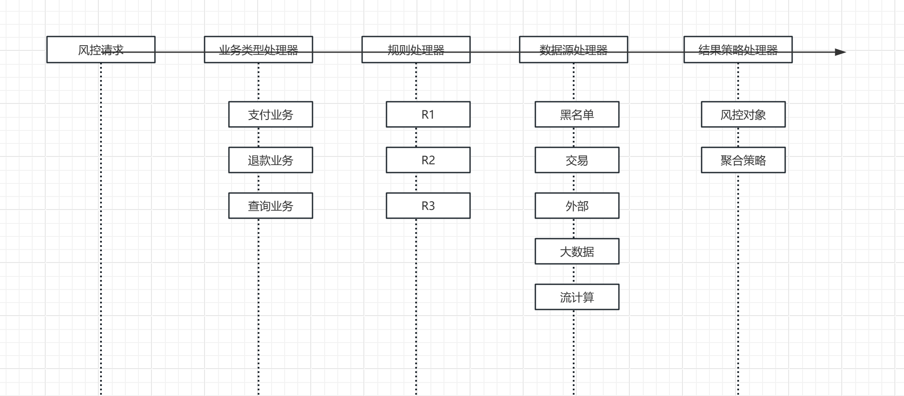
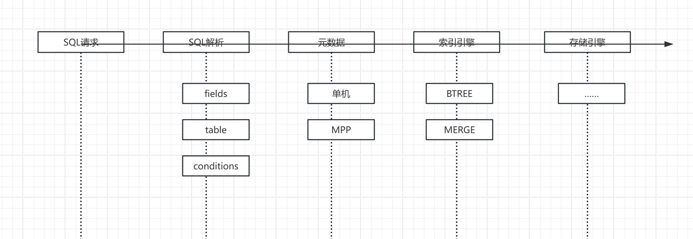

## 综叙

    1，给出架构的定义和追求：
    3，架构设计的兜底方式是什么？
    4，软件架构中落地的方式是什么？

### 架构的定义 
有很多
相关资料如链接
https://zh.wikipedia.org/wiki/%E8%BD%AF%E4%BB%B6%E6%9E%B6%E6%9E%84
https://zh.wikipedia.org/wiki/%E6%9E%B6%E6%9E%84%E6%A8%A1%E5%BC%8F
https://cloud.tencent.com/developer/article/1680724

    我认为，都不准确，个人思考
    
    1，架构存在的前提是在极致的复杂性中、不确定性
    
    2，目标是在这种复杂和不确定性中，追求最大的确定性和可能性空间

### 时序图、架构

    
    1，以上是一个并不标准的时序图
    2，Y是输入信息（聚合根）
    3，X轴是相关的指对象（各种枚举？）
    4，XY轴的耦合叫做聚合（很重要哦）
    5，每个X轴上我们并没有描述细节业务逻辑，而是宏观的业务词典
    6，这个XY轴+词典的区间就是这个系统的可能性空间（业务能力空间）
    
    

    相比传统的数据库，现代的分布式数据库MPP只是在元数据+存储层有了一个枚举值变化。和新的接口实现。
    

### 聚合&真核细胞
    
    1,38y年前，诞生了生命
    2,18y年前，诞生了第一个真核细胞，在此之前，被称为“漫长的20亿年”
    3，在真核细胞之后，生命快速开始演化，虽然历经了5次大灭绝
    ，每次均在几亿年到几千万年的时间内爆炸性演化。
    
    4，复杂科学描述这种现象叫做“涌现”
    
    5，复杂科学无法解释各种不同的涌现的本质差异
        为何1000亿的的雪花叠加，还是雪花，
        为何1000亿的的沙子叠加，还是沙子，
        为何1000亿的的原核细胞，只是海绵，
        为何1000亿的的真核细胞，却产生了复杂生物，
        为何1000亿的的脑细胞，产生了智慧，
    
    6，我认为，真正的涌现，有简单的复杂
    
    7，在一个真核细胞中，
    聚合原本几个独立功能的系统（叶绿体，线粒体，高尔基体……）
    他们彼此有机的组合在一起
    
    而并不是纯粹简单机械的组合。
    
     
    8，DDD的代码角色模型+聚合（XY），就是软件构筑真正复杂系统的真核细胞。
    

 

 
