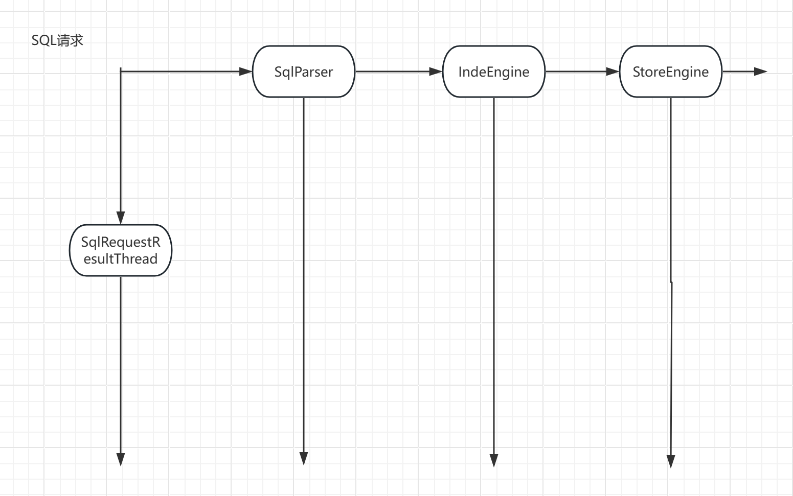

## 综叙

    1，给出架构的定义和追求：
    3，架构设计的兜底方式是什么？
    4，软件架构中落地的方式是什么？

### 架构的定义 
有很多

    1，系统和子系统
    2，模块和组件
    3，业务架构、数据架构、应用架构、技术架构、部署架构……
    4，UML9图
相关资料如链接
https://zh.wikipedia.org/wiki/%E8%BD%AF%E4%BB%B6%E6%9E%B6%E6%9E%84
https://zh.wikipedia.org/wiki/%E6%9E%B6%E6%9E%84%E6%A8%A1%E5%BC%8F
https://cloud.tencent.com/developer/article/1680724

可以看的出来，相似，又很乱。

123的定义模式，其实是循环定义，没有意义。
4的定义本质上是描述操作；他们始终停留在相的层次上，还没有达到见诸相非相。

实际上，架构这个词不仅仅是软件开发行业的。他在其他行业也是非常常见而重要的。
并且他们的内涵其实都一样。

实际上，上面的任何一个定义无法扩展至任何一个其他外延领域。

我认为，架构定义是：复杂+确定性+可能性空间。是在在极大复杂性中追求最大确定性
和可能性空间的设计活动

在软件的架构设计中，有最大确定性和可能性空间的设计理论是领域驱动。从拓扑学上
讲一个东西体积最小，则可能性空间最大。领域驱动排除了所有技术因素、并且将业务
抽象至最小，体积最小可能性最大。而领域概念本身的抽象遵循MECE的原则，技术实现上
遵循（Entity/VO/聚合/工厂/隔离层）这个最佳实践。逻辑上讲是具有最简，具有最低
不确定性的。

### 架构的兜底设计
然而任何客观科学和哲学的基本原则是：越是少的设计，便越是低熵、容易实施、确定高、
可能性空间大的。然而如果有偏差的话：那结果便是混沌。

如何控制呢？
基本原则是：分层、隔离。

然而，分层和隔离是一种熵增的行为，和架构设计的目的就是矛盾的。

所以，并非是越多越好，最佳是在领域的边界处————领域系统是天然隔离的————非领域系统需要
强制性的拆分隔离。————当然必须忍受这种熵增的代价。

大多数系统都可以容忍这种代码，来换取稳定性。当然，极少数几位苛刻的系统不可以，比如操作系统不能
容忍微内核（隔离），游戏系统不能容忍微服务（延迟）。

    大多数系统都可以容忍一定的性能容易，来达成一定的稳定性。 

这种场景也有自己的解决方案，比如虚接口，模块化、零成本抽象……所谓的零成本不是真正的零成本，
当然意味着更大的开发复杂度。

### 聚合

事实上，领域并不完全依赖这种外部的机制来实现极致的确定性和可能性空间。

领域从根本上有自己独立的设计来保障他们。

这就是聚合。

    聚合是个很含混的概念，从DDD诞生依赖，就么有人讲清楚过。我并不是从DDD理论了解聚合的。
    事实上早期我是DDD理论的怀疑者。
    
    我认为并非所有领域都存在领域模型，都适用于领域驱动理论。并且，没有人知道哪个问题不适合。
    大部分时候都是靠感觉和拍脑门做决策，看起来对的理论，但是在复杂系统中相当危险的理论。
    
    ——扯远了

我们用一个例子来说明聚合这个概念的现实中是什么样子的。
数据库处理SQL的时序图。

这个时序图可以分

Y轴：请求对象处理服务

    负责请求对象的处理和生命周期
    和请求对象的数据结构是强耦合的。
X轴：值对象能力集合
    
    请求对象处理过程中涉及的其他能力的集合
    可以不和请求对象的数据解耦耦合。

XY轴的词典的聚合：构成了这个请求处理能力的可能性空间

例如，
在X轴上增加了分布式数据源映射值值对昂。架构就就变成了presto，druid等MPP分布式数据库架构。
后者存储层引擎的词典能力增加了OSS磁盘支持&&元数据调度，就变成了OB这样的分布式数据库。

我们可以看到，能力扩张的主要来源是值对象和值对象词典的扩展。所以

1，保持Y轴实体数据模型对X轴值对象的低侵入、对于系统的可扩展性，可维护性非常重要。

2，必须有一层数据结构（胶水层），能够实现Y轴对X轴的耦合，大概有几种实现方式

    实体服务直接耦合胶水层
    实体服务先耦合工厂层，再耦合胶水层
    实体服务耦合规则引擎，脚本引擎等，胶水层再次外部委托，是独立的一个组件。

前者是很常见的，中间其实也不罕见，例如JDBC,SPI；后者例如模板引擎，ESB等

这层负责将值对象向实体服务聚合的功能，即聚合层。
事实上，聚合层最大的职责不是胶水聚合。而是业务一致性。

我们聚合了N个**值对象（的配置）他们的一致性**应该如何处理呢？

比如，
一个系统更新后，更新了几个配置，其他都是对的，但和这几个不配套，导致用户业务执行到最后
一步才报错。这是不合理的，也是聚合对象应该做的更深层次的、更有价值的东西

（参见vof项目）

### 系统和博弈，有意思的话题

复杂科学描述的系统现象是
    
    1，大象这样的生物，其能耗比蚂蚁要小的多。数学公式是size大10倍，能耗低100倍。
    2，城市大N倍，效率提升N*3/4指数方
    3，系统之间通过信息来交互
    4，在没有信息交互的情况下，子系统博弈会导致囚徒困境，导致整体系统效能最低
    5，一个好的信息交互基于规则，最简的规则不是永恒的善良，或者邪恶；而是基于生存
    的、清晰的博弈策略（反击或者示好）
    6，信息系统，改善社会，大有可为

 

 
