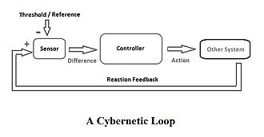

为什么大部分的开发都不愿意维护遗留系统？
为什么大部分的软件容易陷入频繁延期、质量低下的状态？
为什么大部分软件都陷入难读、难维护、反复重构、反复腐化的死循环之中？
……

我同样对这些问题很感兴趣。

# 是设计方案的问题？

请选择

A，是

B，不是。

我认为，答案是B。

我曾经在很多个团队里，帮他们做架构规划，我发现其实他们自己的架构方案和我的并没有什么本质的不同。————在同一个业务领域，大多数审美
取向应该是趋同的。

然而，不容易的是把他们做出来。

我见过很多一线开发团队都容易把好的架构规划出来————甚至他们写的代码很一坨————但是不影响他的设计方案图是清晰的、正确的————

**大多数开发的问题是眼到手不到。**

# 是技术的问题 
请选择

A，是

B，不是。

我认为，答案是B。

国内大多数的软件都是所谓的应用软件。并不太需要所谓高深的技术。这点东西，你用Java写，用C写，用汇编写，除了效率降低点，没有什么本质不同。
————甚至还会更差。

作为一个有20年开发经验的程序员，我见过了servlet时代，MVC时代，开箱即用时代。前者业务代码和底层框架是耦合的，对开发人员有比较高的要求
后者甚至让开发人员来系统搭建都不需要了，直接就开始写业务代码。

但是，应用软件的质量提升了么？软件更容易维护了么？更容易扩展了么？

没有。

**溢出的技术反复深入原理、算法、设计模式……最终只能有副作用。造成更高的工程熵。**

# 是业务的问题
请选择

A，是

B，不是。

我认为，答案是B。

举个例子，恒生电子：他们在国内的银行、证券行业是垄断性质的。这个业务领域变化不大、他们深耕了将近30年、公司有大量同样工龄的老员工。

如果业务领域明确，就比较容易做出优秀的软件的话，他们应该有相当数量的软件质量还可以的。

现实并不是这样的。

而我亲身实践风控领域将近10年，经历了10多次重构，将一个特定领域的数百M的软件改造成只有几K大小的微内核全行业、通用风控系统；却发现
**业务抽象到极致，就是没有业务**；不耦合任何业务，却能适配任何业务；耦合特定业务，必然为其所累。————在高度复杂和关联的软件设计中，任何
小的耦合设计都会被逐步放大，导致整体系统或者通用性、或者性能、或者可维护性的低下。

也就是说，好的设计，当然需要了解业务，然而只需要了解2、3种，最多7~8种；然后就必须将他们抽象，甚至忘记，设计出覆盖度更高的业务。

 
**架构设计，某种程度上是归纳法。**

我很少见到某行业数十年老员工重构出很好的软件、它的概率要低于在这个行业了解了不太久的优秀架构师。前者容易为其所累。

# 到底是什么问题？

我觉得更接近于一个《控制论》的问题。

“控制论”一词最初来源希腊文“mberuhhtz”，原意为“操舵术”

控制论的学科可以分为《信息论》《反馈论》《系统论》

对应系统建设分别是”MDM/主数据/流程“,"MONITOR/数字化",(第三个我想不出来技术上有什么对应的)