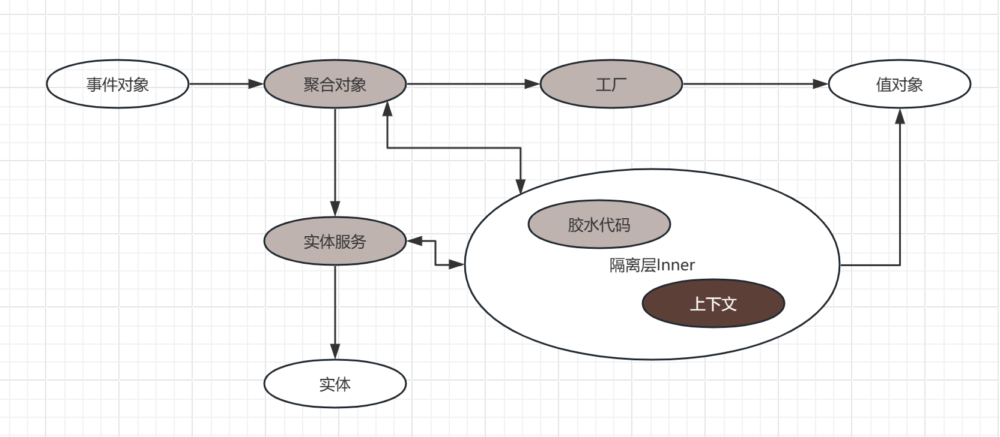

### 事件对象 

抽象：信息的抽象和输入
特征：ID
生命周期：Request/Response
最佳实践：贫血
不可变：是
依赖：无

注意，事件对象是相对于系统的。
例如用户注册对于用户系统是事件对象。对于支付系统是实体。

### 实体

抽象：世界无限性的抽象
特征：ID
生命周期：Request/Response
最佳实践：贫血
不可变：是
依赖：事件对象

注意，事件对象是实体，实体未必是事件对象。
但是不完全相同，比如支付系统中支付订单是事件对象；
但支付订单、用户、商户是实体对象。

### 值对象

抽象：世界有限性的抽象
特征：CODE
生命周期：Application
最佳实践：充血。
不可变：是
依赖：事件对象、值对象工厂

一般而言，所有的代码，配置文件、数据库配置表都是可视做广义的值对象。
狭义而言，架构设计中值对专指业务变化。参见《附录：值对象变化形式和应对技术》

### 聚合

抽象：系统对信息处理的**能力的聚合**
特征：CODE，值对象。
生命周期：Application
最佳实践：充血。
不可变：是
依赖：事件对象、值对象工厂、上下文

最佳实践探索参见vof项目  https://github.com/mmbbdddd/valueobject-factory

### 上下文 

抽象：系统对信息处理的过程的信息的聚合
特征：ID
生命周期：RR
最佳实践：充血。
不可变：否
依赖：事件对象、聚合、上下文值对象

注意，

上下文是所有对象中唯一的可变对象。

上下文和聚合是双向依赖。其他都是单向依赖

### 仓储工厂

### 防腐层

### 附录：

##### 对象生命周期分类

1. Request/Response
2. Application
3. Infrastructure

##### 充血和贫血的最佳设计

| 代码角色 | 生命周期  | 关联对象                        |  
|------|-------|-----------------------------|
| 事件对象 | RR    | 聚合对象（值对象） DAO           |  
| 实体对象 | RR    | 实体服务（值对象）   SAO         |  
| 值对象  | APP   | 值对象仓储工厂/隔离层     Factory |  
| 工厂  | INFRA | 数据库、配置文件、组件                 |  

##### 值对象变化形式和应对技术

| 代码角色 | 变化形式  | 场景举例 | 技术组件                        |  
|------|-------|--|-----------------------------|
| 事件对象 | 数据变化  | WHERE SQL,风控.接入业务 | EL,XPATH,JSONPATH                            |  
| 实体对象 | 数据变化  | SELECT SQL,风控.数据源 | EL,XPATH,JSONPATH           |  
| 值对象  | 数据变化  | 风控.规则/支付网关.支付渠道 | 工厂，引擎 |  
| 值对象  | 逻辑变化  | 支付网关.支付渠道报文格式解析组装 | 工厂、引擎 |  
| 工厂  | 数据变化 | sfl4j，*starter | 条件检测                 |  

##### 代码角色模型关系图

 